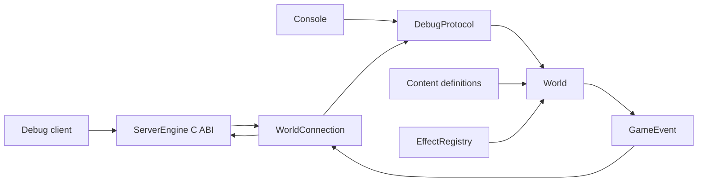

# C++ Game Architecture

The project is a small, data-driven gameplay host on top of ServerEngine. It is
structured so new characters, skills, effects, and maps can be added through
content first, and through focused C++ handlers only when behavior needs new
code.

## Runtime Flow

`main` loads `content/demo.game`, creates one `World`, and either runs console
mode or starts the ServerEngine TCP host. ServerEngine owns socket I/O and frame
assembly. The game code receives complete `GAME/1` text messages and emits text
responses/events.

## Ownership

`World` owns all entities, timers, cooldowns, effects, and event queues. A
network session stores only the entity ID that it created. Client input can ask
to move or cast, but only `World` mutates HP, mana, cooldowns, effect timelines,
and positions.

The current host runs a single in-memory world. It has no database, shard
migration, reconnect persistence, AI, respawn, AOI, trading, inventory, quests,
or production account system yet. Those systems should be added outside the
effect callbacks and applied to the world through explicit commands/snapshots.

## Skills And Effects

`SkillDefinition` is data: target rule, mana cost, cooldown, range, radius,
maximum targets, and an ordered list of effect IDs. `EffectDefinition` is data:
handler ID, amount, scaling attribute, duration, period, stacking policy, tags,
and visual event ID.

The built-in handlers cover:

- `damage`
- `heal`
- `periodic_damage`
- `modifier`
- `control`
- `shield`

To add a data-only skill, define an effect, define a skill that references it,
and add the skill to a character. To add a new mechanic, register an
`EffectHandler` with validation before creating the world. The `WorldTests`
fixture includes a custom `regeneration` handler example.

## Simulation Rules

World time is integer milliseconds and cannot move backward. Network mode
advances in fixed 50 ms ticks; console mode advances only through `TICK`.
Periodic ticks at the expiry timestamp run before the effect expires.

Before a command mutates state, the world checks ownership, alive state, control
tags, cooldown, mana, map, target relation, range, effect limits, and event queue
capacity. Rejected commands do not spend mana, consume cooldown, move entities,
or emit partial events.

Damage, healing, shield absorption, death, movement, effect application,
expiration, and visual notifications all become `GameEvent` records. The network
host broadcasts events only to sessions that already created a character in the
same map.

## Resources

The server does not load sprites, audio, Unity assets, map images, or tile
atlases. Content can emit stable IDs such as `visual=energy_burst`; the client
decides how those IDs map to actual assets. Server-side map definitions currently
need only simulation dimensions.

If a future client uses Unity, Tiled, LDtk, asset bundles, or a custom binary map
format, keep that pipeline on the client/resource side. Only send IDs and
authoritative gameplay state across the protocol.
