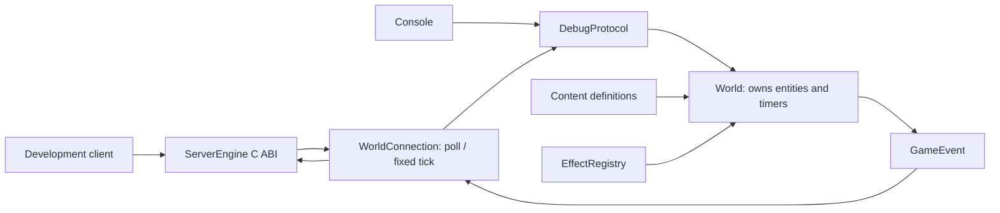

# Kiến trúc game C++

Mục tiêu là mở rộng nội dung và cơ chế game mà không gom mọi thứ vào `Player`.
Mã Java là nguồn đối chiếu hành vi; không giữ kiểu singleton toàn cục và mỗi zone
tự tạo thread của bản cũ.

## Host và profile hiện tại

Host mới gọi `application::GameModule` với một payload hoàn chỉnh từ
`SE_PROTOCOL_TCP`. `TcpHost` không biết kỹ năng, tài khoản hay format nhân vật.
`BinaryPacketCodec` đọc command byte và payload nhị phân; `LegacyApplication`
giữ phiên bản, xác thực và cache. `LegacyGameplay` là điểm nối gameplay có thể
thay thế. `IdentityStore` tách persistence; SQLite hiện dùng cho account/character
cục bộ và giữ revision để chặn stale save.

`LegacyWorld` giữ definition bất biến, actor/mob riêng, learned skills, cooldown
và effect timeline; RNG được inject để đối chiếu/replay. Luật HUNR nằm trong
profile legacy; game mới có thể dùng registry ID chuỗi bên dưới. Host chưa cài
full gameplay adapter cho mọi luồng Java. Các mục bên dưới mô tả world demo.

## Ownership và thread

`main` sở hữu `World`. World giữ một bản content riêng, registry riêng và tập
entity theo ID ổn định. Session chỉ giữ `EntityId`, không giữ con trỏ sở hữu nhân
vật. Mỗi instance world chỉ có một thread cập nhật; luồng I/O của ServerEngine
đưa sự kiện vào hàng đợi DLL và không sửa HP, mana hoặc cooldown.

World demo hiện là một shard trong RAM. Lặp qua entity bằng `std::map` cho thứ tự ổn
định. Chưa có distributed shard, migration giữa process, AOI/spatial index,
database hay cơ chế khôi phục nhân vật khi kết nối lại. Entity đã despawn không
dùng lại ID. Server transport có RAII stop/destroy và đóng khi mất sự kiện.

Khi thêm persistence, đặt I/O ở worker/repository ngoài world. Chuyển snapshot
bất biến hoặc ID + version qua queue; chỉ áp kết quả về world tại tick sau khi
kiểm tra entity/session generation. Không đưa SQL hoặc callback I/O vào effect.

## Một lần dùng kỹ năng

`Session → DebugProtocol::dispatch → World::cast → ordered effect list → GameEvent`.

World kiểm tra quyền dùng skill, còn sống, control tags, cooldown, mana, quan hệ
đồng minh/kẻ địch, map và khoảng cách trước khi trả chi phí. Mục tiêu chính đứng
đầu; AoE chọn thêm mục tiêu gần nó theo khoảng cách và ID. Giới hạn effect và
event được kiểm tra trước mutation. Damage/heal chỉ đi qua world, không nhận HP
hoặc mana mới từ client.

`SkillDefinition` là dữ liệu dùng chung; `Entity::cooldowns` là trạng thái riêng.
`EffectDefinition` là dữ liệu dùng chung; `ActiveEffect` giữ nguồn gây hiệu ứng,
power tại lúc áp, số stack, thời điểm hết hạn, nhịp tick, modifier và shield pool.
Hiệu ứng cùng ID từ hai nguồn khác nhau có hai instance.

Nhịp simulation dùng số nguyên milliseconds; advance không được quay ngược.
Các tick đúng tại thời điểm hết hạn chạy trước bước expire. Gia hạn giữ nhịp
periodic đang chờ, kể cả nhịp nằm sau thời điểm hết hạn cũ. Event được thu sau mỗi
lệnh/nhịp bởi host; bước console quá lớn có thể bị từ chối do event budget.

## Thêm nội dung

- Nhân vật: thêm `[character id]`, các `stat.*`, tags và danh sách skill.
- Kỹ năng: thêm `[skill id]`, target/cost/cooldown/range và danh sách effect theo thứ tự.
- Biến thể hiệu ứng: thêm `[effect id]` dùng một handler hiện có và tham số khác.
- Cơ chế mới: đăng ký `EffectHandler` bằng `EffectRegistry::add` trước khi tạo world,
  kèm validator và test cho hành vi. Ví dụ regeneration nằm trong WorldTests.
- Thuộc tính: thêm key trong `Attributes`; effect modifier có thể tham chiếu key đó.
  System thực sự sử dụng thuộc tính vẫn phải được lập trình, chẳng hạn crit hoặc dodge.

Callback effect chỉ được sửa tài nguyên của target qua world và dữ liệu instance;
không spawn/despawn/cast đệ quy hoặc sửa vector effects/lịch tick trong callback.
`EffectHandler::maxResourceCallsPerCallback` khai báo số lần tối đa mỗi callback
gọi `World::damage` hoặc `World::heal`: mặc định 1, cho phép 0..256. Handler chỉ
sửa modifier/control/shield dùng 0. Tài nguyên và shield phải hữu hạn, không âm.
World dự trù cả absorption, damage/heal, death, visual và effect expiry trước
khi cast hoặc advance; thiếu chỗ trong queue thì trả `event_budget` trước khi
trừ mana/cooldown hoặc đổi clock/state. Advance bị từ chối có thể cần drain event
và chia interval nhỏ hơn; nếu một mốc tick vẫn quá lớn thì phải giảm workload.
Spawn và move cũng kiểm tra queue trước khi đổi entity. Handler vi phạm bound
hoặc ném exception là lỗi lập trình; hệ thống không rollback tùy ý code callback.
Cơ chế summon, projectile, trigger đệ quy và delayed cast cần command queue/system riêng
với phase rõ ràng; chưa được quảng cáo là có sẵn. Cơ chế này cho phép thêm handler
trong code, không phải nạp DLL/script tùy ý lúc đang chạy.

## Combat của demo

Power = magnitude + effective caster attribute × scaling factor; được chụp khi
áp effect. Damage = max(1, power − defense), sau đó trừ vào shield pool rồi HP.
Heal không tự revive. Modifier được cộng vào base stat khi đọc và bỏ khi expire,
tránh cộng/trừ lặp gây lệch stat. Thay max HP/mana sẽ clamp tài nguyên hiện tại.
Control tags `stunned`, `silenced`, `rooted` được world đọc; visual chỉ phát ID cho
client, server không chứa ảnh hoặc renderer. Số thực và các cap của demo khác
số nguyên và các ngoại lệ combat Java; xem migration-status.

## Ranh giới của ServerEngine

Host gọi `se_server_create/add_listener/start/poll_event/send/stop/destroy` qua
public C ABI. Không đổi source submodule. DLL xử lý length TCP 4 byte big endian;
payload live là command byte + dữ liệu nhị phân, không có frame Java lồng bên
trong và không XOR/Base64. Người dùng đã chọn sửa client cho format này.
Codec HUNR cũ chỉ dùng làm nguồn so sánh ngoại tuyến.

Các test C++ đã được viết cho lifecycle, extension, parser và protocol, nhưng
chưa compile hoặc chạy theo yêu cầu không build. Kiểm tra source không chứng minh
khả năng chịu tải, độ trễ, Windows/Linux runtime hay độ tương thích client cũ.
